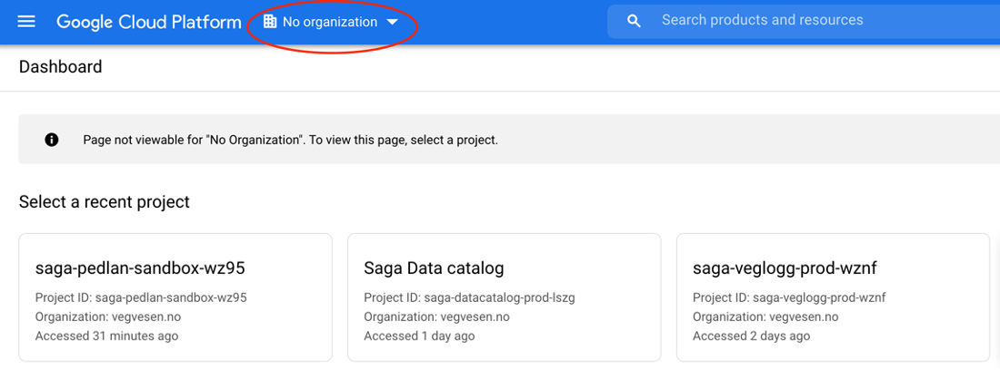
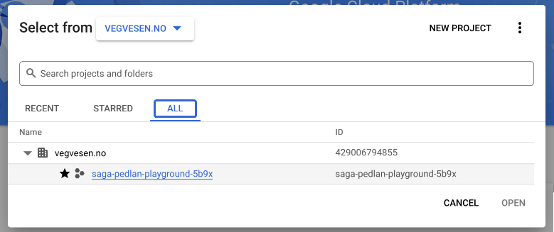

# Kom i gang

Før du kan begynne å utforske datasettene må du logge inn i GCP og velge ditt personlige prosjekt. Dersom du har gjort dette tidligere kan du hoppe over stegene under.

## Innlogging

Først skal du logge inn i Google Cloud Platform (GCP). Gå til https://console.cloud.google.com og logg inn med din SVV-bruker. Dersom du fra før har logget inn med en personlig google-bruker bør du bruke en annen nettleser eller lage en egen profil for dette. [Her kan du lese om hvordan egne profiler opprettes for Edge.](https://support.microsoft.com/en-us/topic/sign-in-and-create-multiple-profiles-in-microsoft-edge-df94e622-2061-49ae-ad1d-6f0e43ce6435)

Etter første innlogging vil du bli spurt om å godkjenne vilkår for bruk av GCP – kryss av for dette. Du trenger ikke å krysse av for å motta e-poster fra Google.

## Finn og velg ditt prosjekt

Du har fått et prosjekt på GCP. Et prosjekt i GCP er et arbeidsområde hvor du kan opprette ressurser som trengs i ditt analysearbeid, kjøre SQL-spørringer i datavarehuset BigQuery og lignende.

Når du jobber i GCP skal du alltid ha valgt dette prosjektet. Dette kan du gjøre med én gang. Du kan velge ditt prosjekt ved å trykke på prosjektvelgeren øverst på siden, slik som i bildet under.

Sørg for at det står vegvesen.no i «Select from ...» øverst i prosjektvelgeren.

Velg så fanen «All». Klikk deretter på ditt prosjekt, som har et navn på formatet: «saga-< brukernavn>-playground-< suffix>». Du skal da kunne se navnet på ditt prosjekt øverst på siden.

