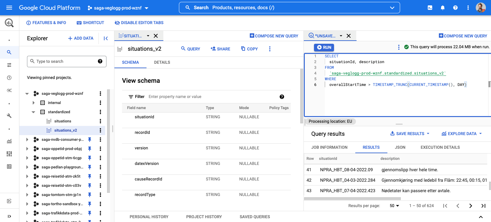
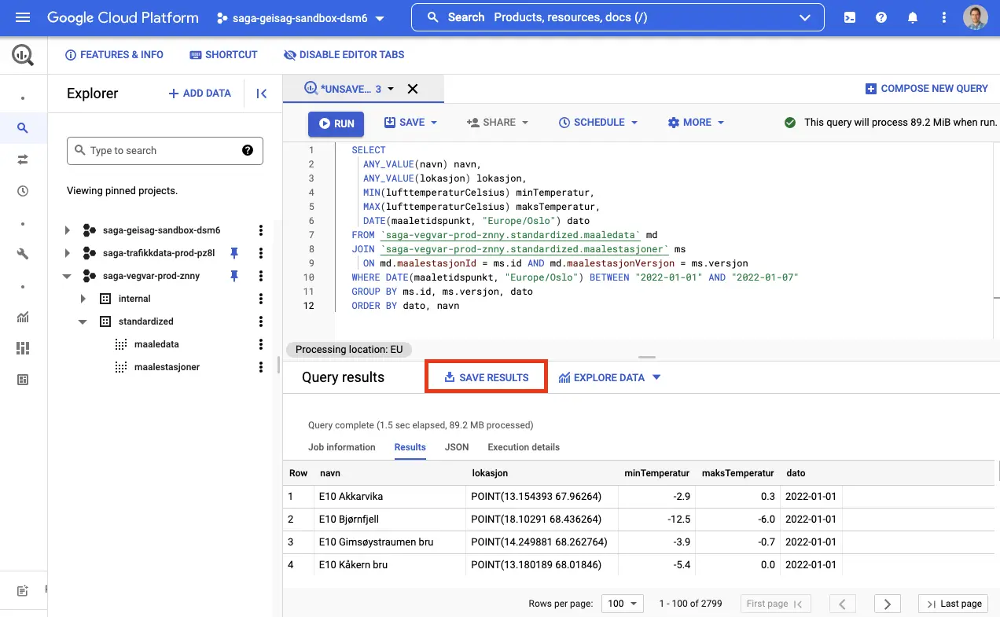

# Bruk av BigQuery

Det finnes mange forskjellige måter å bruke BigQuery på. Du kan f.eks. bruke BigQuery fra:

- Google Cloud Console
- Egen maskin (via `bq` eller et SQL-verktøy)
- Jupyter Notebooks, f.eks. i [Google Colab](https://colab.research.google.com/)
- Egenskrevne applikasjoner

## Bruke BigQuery fra Google Cloud Console

Den desidert enkleste måten å komme i gang med BigQuery på er via Google Cloud Console. Her kan man bl.a. utforske eksisterende datasett, deres skjema og kjøre SQL-spørringer direkte i nettleseren.

.

Besøk [BigQuery i Google Cloud Console](https://console.cloud.google.com/bigquery)

## Koble seg til BigQuery fra egen maskin

For å kalle BigQuery fra egen maskin må du ha satt opp autentisering. Den enkleste måten å gjøre dette på er å bruke [Google Cloud CLI (gcloud)](https://cloud.google.com/sdk/docs/install).

Når du har fulgt installasjonsveilederen i linken over, kan du kjøre følgende:

```bash
gcloud auth login
gcloud auth application-default login
```

For hver av disse vil du få opp en nettside der du må godkjenne innlogging med din `<fornavn.etternavn>@vegvesen.no`-bruker.

Før du kan begynne å gjøre spørringer bør du sette opp default project og default quota project (sett inn IDen til ditt prosjekt):

```bash
gcloud config set project saga-olanor-playground-1234
gcloud auth application-default set-quota-project saga-olanor-playground-1234
```

## Laste opp egne datasett

Hvis du har egne datasett liggende i CSV eller JSON-format og ønsker å bruke disse til analyse i BigQuery kan du følge Googles guide for [CSV](https://cloud.google.com/bigquery/docs/loading-data-cloud-storage-csv#loading_csv_data_into_a_table), [JSON](https://cloud.google.com/bigquery/docs/loading-data-cloud-storage-json#loading_json_data_into_a_new_table) og mange andre formater.

## Laste ned datasett og resultater

Det finnes mange måter å hente data ut fra BigQuery på. Her følger en forklaring på hvordan datasett og resultat av spørringer i BigQuery Cloud Console enkelt kan eksporteres som JSON.

For å kunne eksportere data må du først ha opprettet en GCP-bruker og et prosjekt.

1. Gå til [Målestasjoner-datasettet i BigQuery](https://console.cloud.google.com/bigquery?p=saga-vegvar-prod-znny&d=standardized&t=maalestasjoner&page=table).

Prosjektet i prosjektvelgeren skal være satt til ditt personlige prosjekt. Det gjør at du får lov å kjøre spørringer mot BigQuery.

2. Legg inn følgende spørring:

   ```sql
   SELECT
     ANY_VALUE(navn) navn,
     ANY_VALUE(lokasjon) lokasjon,
     MIN(lufttemperaturCelsius) minTemperatur,
     MAX(lufttemperaturCelsius) maksTemperatur,
     DATE(maaletidspunkt, "Europe/Oslo") dato
   FROM `saga-vegvar-prod-znny.standardized.maaledata` md
   JOIN `saga-vegvar-prod-znny.standardized.maalestasjoner` ms
     ON md.maalestasjonId = ms.id AND md.maalestasjonVersjon = ms.versjon
   WHERE DATE(maaletidspunkt, "Europe/Oslo") BETWEEN "2022-01-01" AND "2022-01-07"
   GROUP BY ms.id, ms.versjon, dato
   ORDER BY dato, navn
   ```

Denne spørringen vil hente ut alle minimums- og maksimumstemperaturer mellom 1. og 7. januar 2022.

3. Kjør spørringen, og velg så **SAVE RESULTS.**



4. Du vil få spørsmål om ulike lagringsmuligheter. Velg f.eks. **JSON (local file).** Denne nedlastingen støtter opp til 16 000 rader.

Deretter kan du åpne JSON-filen i et tekstredigeringsprogram, som f.eks. [Visual Studio Code](https://code.visualstudio.com/).


Denne dataen kan prosesseres videre offline, f.eks. ved hjelp av verktøy som [jq](https://stedolan.github.io/jq/), eller lastes inn i et annet analyseprogram, som Excel, [Data Studio](https://datastudio.google.com/) eller [Power BI](https://powerbi.microsoft.com/).
