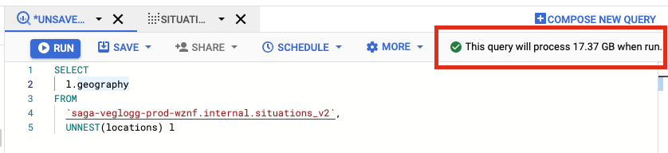

# Analyse i BigQuery

[BigQuery](https://cloud.google.com/bigquery) er GCP sin SQL-kompatible database/datavarehus for effektiv analyse, selv når datamengdene blir store. Du jobber typisk i [BigQuery Console](https://console.cloud.google.com/bigquery), men det er også mulig å gjøre spørringer både fra kommandolinjen med [bq-klienten](https://cloud.google.com/bigquery/docs/quickstarts/load-data-bq), eller fra f.eks. [Jupyter Notebook](https://cloud.google.com/bigquery/docs/visualize-jupyter).

## Når bør du bruke BigQuery?

BigQuery er et godt valg når du ønsker å:

- **Kjøre analyser på større mengder strukturerte data.**
  BigQuery lar deg gjøre spørringer på petabytes med data. Prosesseringstiden er i stor grad begrenset av effektiviteten til spørringene du skriver heller enn tiden det tar å kverne gjennom store mengder data. Det som er viktig å være klar over er at _man betaler for mengden data som prosesseres_, og ikke kjøretid eller ressursbruk som kanskje hadde vært å forvente.

- **Sammenstille ulike datasett.**
  Selv om BigQuery ikke støtter primær- og fremmednøkler slik som tradisjonelle SQL-databaser gjør, egner den seg godt for rask sammenstilling av data fra forskjellige kilder, også for store mengder data. Dette kan gjøres ved å bruke `JOIN` på verdier, f.eks. tidspunkt, for å sammenligne data på tvers av tabeller. Her må man være spesielt oppmerksom på om felter i datagrunnlaget kan endre innhold over tid, selv om de representerer det samme.
- **Dele strukturert data.**
  BigQuery egner seg veldig godt til deling av strukturert og veldokumentert data, på et velkjent format, som er enkelt å konsumere for andre mottakere. Ved å ha fokus på å benytte de innebygde datatypene der det gir mening, som f.eks. `TIMESTAMP`, `DATE` og `GEOGRAPHY`, lettes bruk og sammenstilling av data betraktelig for andre konsumenter.
- **Benytte SQL-kompetanse.**
  For å spørre ut data fra tabeller og views i BigQuery benytter man Standard SQL. Her er eksisterende SQL-kompetanse i stor grad overførbar, i tillegg til ekstra funksjonalitet som tilbys, f.eks. for GIS-operasjoner på geografiske data. Databasen har også klientbiblioteker i ulike språk for de som ønsker å skrive applikasjoner som aksesserer data: Python, Java, Go, C#, PHP, Ruby, and Node.js.
- **Tilgang på avanserte analytiske funksjoner.**
  Databasen har god støtte for avanserte analytiske funksjoner som kan være nyttige i analyser av data, som f.eks. `GROUP BY` , `SUM()`, `ARRAY_AGG()`, `PARTITION BY` , `LEAD()`, `LAG()` , `FIRST_VALUE()`, `LAST_VALUE()` og `ANY_VALUE()` for å nevne noen.
  Se også [oversikten over tillgjengelige funksjoner](https://cloud.google.com/bigquery/docs/reference/standard-sql/aggregate_analytic_functions) og [Googles egen forklaring av analytiske konsepter](https://cloud.google.com/bigquery/docs/reference/standard-sql/analytic-function-concepts).

Noen ting BigQuery -ikke- kan/bør brukes til er:

- **Ustrukturert data - bruk heller GCS eller Datastore.**
  For ustrukturerte data som ønskes lagret på fil er GCS å foretrekke, mens Datastore er et godt alternativ som dokumentlager (NOSQL).
  Selv om det er mulig å mate ustrukturerte data som JSON inn i BigQuery og spørre på de, vil vi anbefale å benytte strukturerte data i den grad det er mulig. Dette fordi dypt nøstede JSON-strukturer i enkelte tilfeller krever unødvendig mye innsats for å få spurt ut riktig, med kombinasjon av kryssing av eksisterende rader og bruk av `UNNEST()` som ikke nødvendigvis er intuitivt for nye brukere.
- **Transaksjonell/operasjonell data - bruk heller PostgreSQL.**
  Støtten for transaksjoner i databasen har inntil nylig vært veldig begrenset. Det foregår derimot til stadighet forbedringer som kontinuerlig rulles ut, både mtp featuresett og tilgjengelige SQL-operasjoner. Tidlig i april 2022 er [BigQuery-støtten for transaksjoner i “pre-GA”](https://cloud.google.com/bigquery/docs/reference/standard-sql/scripting#transactions).
- **Relasjonelle data og data som trenger indekser - bruk heller PostgreSQL.**
  Bigquery støtter ikke primær- og fremmednøkler og de garantier de kan gi, ei heller indekser for raskere søk og oppslag. Om dette er funksjonalitet du har bruk for vil vi heller anbefale PostgreSQL eller lignende.
  Derimot er støtten for sammenstilling av store mengder data fortsatt god, feks ved bruk av `JOIN`. Tabeller i BigQuery kan også både [clustres](https://cloud.google.com/bigquery/docs/clustered-tables) og [partisjoneres](https://cloud.google.com/bigquery/docs/partitioned-tables), som kan bidra til å øke ytelsen på spørringer og føre til besparelser ved at de underliggende data samlokaliseres.
- **Caching - bruk heller Memorystore og/eller Redis.**
  Direkteoppslag på enkeltrader er ikke noe BigQuery er spesielt godt egnet til. Her finnes det mye bedre valg i andre teknologier, som f.eks. Memorystore og/eller Redis.
  BigQuery-databasen i sin _kolonnebaserte_ natur gjør at alle oppslag du gjør mot en kolonne vil måtte hente alle data for den valgte kolonnen (med mindre clustering eller partisjonering er i spill).
- **Hurtig endrende sanntidsdata - bruk heller PostgreSQL eller Datastore.**
  BigQuery har to måter å laste inn data på: batch jobs og streaming. Batch jobs passer for engangs eller periodisk innlasting av store datasett, mens streaming kan brukes for sanntidsdata. På grunn av databasens høye skriveytelse ved streaming av sanntidsdata har den begrensninger når det kommer til å operere på data som nylig er satt inn på denne måten. Du kan ikke umiddelbart endre eller slette rader som streames inn til BigQuery. Har du slike behov er det derfor bedre å vurdere PostgreSQL eller Datastore.

Se også [Googles introduksjon til BigQuery](https://cloud.google.com/bigquery/docs/introduction).

## Prismodell

Når man gjør spørringer mot BigQuery betaler man for _mengden data spørringen prosesserer_, heller enn kjøretetid og ressursbruk.

Editoren i [BigQuery i Cloud Console](https://console.cloud.google.com/bigquery) som kan brukes til å utforme og kjøre SQL-spørringer gir et anslag på hvor mye data en spørring kommer til å prosessere før den kjøres. Denne funksjonaliteten kan være grei å holde et øye med før spørringer kjøres! Om du har flere spørringer i samme vindu kan du markere den spørringen du ønsker å se størrelsesestimatet for.

Per april 2022 betaler man $5 per prosesserte Terrabyte (TB) med data i EU-regionen ([Kilde](https://cloud.google.com/bigquery/pricing/#on_demand_pricing)).

For data som lagres over tid betaler man ~$20 per TB per måned for tabeller og partisjoner som er skrevet til de siste 90 dager, og ~$10 per TB per måned for de som blir skrevet sjeldnere til ([Kilde](https://cloud.google.com/bigquery/pricing/#storage)).

## Kolonnebasert lagring

BigQuery databasen er _kolonnebasert_, noe som betyr at det er veldig mye å spare på å utelate kolonner du ikke har bruk for fra spørringer, f.eks. store geografikolonner, og ikke alltid direkte gå for `SELECT *`. Dette er fordi data for hver kolonne ligger lagret sammen, heller enn rad for rad slik som man kanskje er vant med fra tradisjonelle SQL databaser.

Det betyr også at kolonnen i sin helhet må hentes om den spørres på, med mindre [clustering](https://cloud.google.com/bigquery/docs/clustered-tables) eller [partisjonering](https://cloud.google.com/bigquery/docs/partitioned-tables) er i bruk, selv om spørringen f.eks. har en `WHERE`-clause eller andre mekanismer for filtrering av enkeltrader.

At de underliggende dataene ligger lagret samlokalisert per kolonne er en av grunnene til at denne typen databaser passer så godt til analytiske oppgaver der det er høye krav til rask prosessering av queries.
