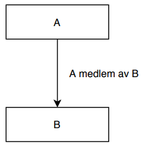
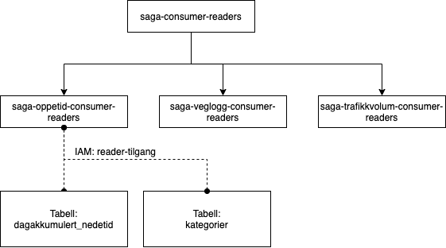
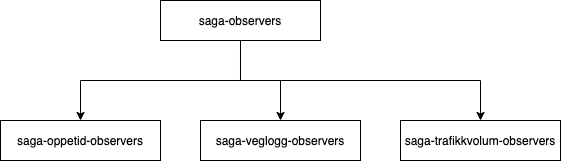
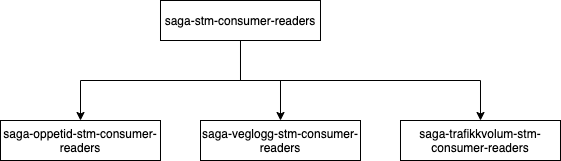

# Datasoner og tilgangsgrupper

Her følger informasjon om datasoner og tilgangsgrupper for data som deles på Saga.

Denne informasjonen er nyttig for team som skal bruke data fra Saga, og for de som skal publisere data dit.

## Hvorfor datasoner?

Vi ønsker at datasettene på dataplattformen skal deles inn i soner. Ulike soner har ulike krav til blant annet datakvalitet og kompletthet, og dermed vil en sone si noe om hva du kan forvente av datasettene den inneholder. Andre fordeler med soneinndeling er blant annet:

- Vi kan ha ulik tilgangsstyring på sonenivå.
- Det er lettere å finne datasett på det dataformatet du ønsker, fordi det inngår i definisjonene av en sone.
- Det bidrar til helhetlige datasett siden sonene legger føringer for ulike datatyper og dataformater et datasett må ha for å være en del av sonen.

## Soner, prosjekter og tilganger

I Google Cloud Platform (GCP) må alle ressurser, inkludert datalager, opprettes i et GCP-prosjekt. I tillegg er det slik at ulike typer data skal lagres i ulike datalagertjenester. Dermed vil ulike datasett tilsynelatende ligge spredt ut over ulike prosjekter og tjenester.

For å samle datasett på tvers av prosjekter og lagringstjenester har vi en [datakatalog](https://saga-datacatalog-prod-lszg.ew.r.appspot.com/). Her vil det finnes metadata om datasettene, blant annet hvilken datasone datesettet ligger i. Dette har vi for å hjelpe deg med å forstå hva du kan forvente av standardisering og datakvalitet i et datasett.

Generelt sett vil alle som har tilgang til et GCP-prosjekt kunne registrere sine datasett i ulike soner. Unntaket vil sannsynligvis være i `consumer`-sonen (forklares under), hvor vi på sikt ønsker en godkjenningsprosess for å sikre at datasettene er tilstrekkelig dokumentert. Den som registrerer et datasett i en sone kan sies å være "datasettets dataeier". Dataeier har ansvar for at datasettet tilfredsstiller føringer og krav som gjelder for en gitt sone.

## Soneinndelingen vi bruker

Datasonene vi ønsker å bruke er

- `raw`
- `standardized`
- `curated`
- `consumer`
- `analytics`.

### Raw

- Her ligger ulike typer rådata som ikke har blitt prosessert
  - Ustrukturerte data og strukturerte data som ikke har den strukturen vi ønsker på plattformen
- Lagres så lenge som mulig eller så lenge det kan være behov for dataene slik at deriverte data kan regenereres, for
  eksempel i forbindelse med feil eller endringer som krever det
- Eksempel: bilder, video, XML, CSV, JSON
- Foreslått lager: Google Cloud Storage

### Standardized

- Her ligger data i en struktur med standardiserte datatyper
- Dataene her har ikke vært gjennom særlig prosessering eller forretningslogikk forutenom konvertering av datatyper og
  dataformat
- Dataene her gjør det enklere å utføre prosessering og analyse senere sammenlignet med det som ligger i `raw`
- Det er akseptabelt å ikke ta med alle felter fra datakilden dersom de åpenbart ikke er relevante eller dersom det
  medfører mye arbeid å få med alt
- Trenger ikke å lagres lenge, siden de kan regenereres fra data i `raw`
- Eksempel:
  - Fra gzippet XML til Avro-format
  - Fra UTM33 til WGS84-koordinater
  - Fra ulike datoformat til ISO8601 med tidssone
- Foreslått lager: Google Cloud Storage, BigQuery, m.fl.

**Obs**: Dersom du er usikker på om konvertering av data begynner å nærme seg forretningslogikk, er det sannsynlig at
dataene heller bør plasseres i `curated`.

### Curated

- Her har dataene gjerne blitt forandret av forretningslogikk, og kan være sammenstilt fra flere kilder
- Filtrerer gjerne vekk flere datapunkter enn i tidligere steg
- Har kvalitetssjekket dataene
- Lagres så lenge som mulig eller så lenge det kan være behov for dataene slik at deriverte data kan regenereres, for
  eksempel i forbindelse med feil eller endringer som krever det
- Foreslått lager: Google Cloud Storage, BigQuery, m.fl.

### Consumer

- Datasett som ligger i denne sonen er klar for at andre brukere av dataplattformen kan ta de i bruk
- Datasettene er godt beskrevet. Blant annet må du beskrive:
  - Datakvalitet
  - Datamodell
  - Hvor dataene kommer fra
- Kanskje vil det bli nødvendig å avgrense tilgangen til å plassere datasett i consumer for å sikre at det som ligger
  der tilfredsstiller krav til kvalitet og dokumentasjon
- Lagres så lenge som mulig eller så lenge det kan være behov for dataene
- Foreslått lager: Google Cloud Storage, BigQuery, m.fl.

### Analytics

- Denne sonen er tenkt at vi skal ta i bruk på sikt. Den er til for at datavitere skal kunne lage potensielt
  midlertidige datasett når de utfører dataanalyse.
- For eksempel kan det tenkes at en dataviter drar inn data fra eksisterende datasett i `consumer`, gjør noen analyser
  på disse, og lagrer resultatet i en tabell i `analytics`. Kanskje er det behov for å dele denne tabellen med andre.
- Vi har også foreslått en selvbetjeningsløsning som gjør at datavitere blant annet kan laste opp egne datasett og be om
  tilgang til GCP-tjenester som muliggjør analyse.
- Datavitere får i dag hvert sitt GCP-prosjekt opprettet, og det er i hovedsak disse som skal brukes når data lagres i `analytics`.

### Typisk dataflyt

Figuren under illustrerer hvordan data transformeres og forflyttes på plattformen, gjennom ulike soner. Figuren viser
også hvordan datasett kan bli registrert i en datakatalog samt hvordan du via en selvbetjeningsløsning kan oppdage
datasett og registrere egne datasett. Du kan også se at data i `consumer` tilgjengeliggjøres for andre via API,
dashboard og lignande (i tillegg til internt på plattformen).

### Nyttig å vite om datasoner

- Det er ikke detaljert hvilken prosess du må gjennom for å registrere et datasett i `consumer`-sonen
- For at datakatalogen skal plukke opp delte BigQuery-tabeller automatisk, må de ligge i et BQ Dataset med navn lik datasonen de tilhører. F.eks. vil veglenker fra NVDB ligge i datasone Standardized, slik at hele tabell-IDen inkludert prosjekt blir: `saga-nvdb-prod-vlmh.standardized.veglenker`.
  - I tillegg må tabellen minst ha beskrevet et sett med metadata [som definert i vår Terraform-modul her](https://github.com/svvsaga/terraform-modules/tree/main/datacatalog_tags_dcat_egenskaper).

## Tilgangskontroll

Tilgangskontroll gjøres gjennom definisjon av _identity-role-resource_. Hvem (identity) har hvilken tilgang (role) til
hvilken ressurs (resource).

### Tilgangsgrupper på dataplattformen

Vi bruker et gruppehierarki for å styre brukeres tilgang til ulike datasoner på dataplattformen. Dette gjør det enkelt å
gi personer eller service accounts tilgang til en eller flere datasoner - ved å legge de til i gitte tilgangsgrupper
fremfor å lage IAM-bindings for enkeltpersoner.

I hovedsak trenger vi to typer grupper - det vi kaller "reader"-grupper og det vi kaller "observer"-grupper. En
reader-gruppe er en gruppe som brukes for å få lesetilgang til en eller flere datasoner. En observer-gruppe gir på sin
side bare tilgang til å få vite at datasett i en datasone eksisterer, og lese eventuelle metadata om datasettene. Disse
gruppene skal gi følgende tilganger:

### Tilganger som tilhører reader-gruppene

Dette er tilganger som må gis til gruppene på nederste nivå i reader-hierarkiet (se figurer lengre nede), altså gruppene
som opprettes per datasone.

- For BigQuery: `roles/bigquery.dataViewer` per BQ-datasett (konsument må betale for spørringer i eget prosjekt)
- For GCS: `roles/storage.objectViewer` på bøttenivå
- For Cloud SQL/Postgres: Må lage en "federated data source connection" og gi gruppen `bigquery.connection.user` på
  denne
- Andre datalagere legges til her ved behov

### Tilganger som tilhører observer-gruppene

Dette er tilganger som må gis til gruppene på nederste nivå i observer-hierarkiet (se figurer lengre nede), altså
gruppene som opprettes per prosjekt.

- For BigQuery: `roles/bigquery.metadataViewer` per BQ-datasett (konsument må betale for spørringer i eget prosjekt)
- For alle andre typer datasett: Må ha lesetilgang til datakatalogen (`roles/datacatalog.viewer`), hvor datasettet må
  være registrert med metadata.

### Uegnede datalagere

Datalagere som dugler tilgangsstyring per datasett skal helst ikke brukes når du skal dele data på dataplattformen.
For eksempel er det slik at dersom du gir noen lesetilgang til Cloud Datastore vil de få tilgang til alt som ligger
der. Dette gjør at du for eksempel ikke kan skille mellom consumer-data, som alle skal ha tilgang til, og raw-data, som
færre skal ha tilgang til.

### Hvilke tilgangsgrupper finnes?

På toppnivå i gruppehierarkiet finnes det en reader-gruppe for hver datasone. Unntaket er tilgangsgruppene for `raw`
og `standardized`. Siden disse dataene i utgangspunktet er de samme, men med forskjellig format, har vi slått sammen
disse tilgangsgruppene. I tillegg finnes det en observer-gruppe. Denne gruppa går på tvers av datasonene, siden alle som standard bør få lov å se hvilke datasett som finnes. Dermed får vi
følgende grupper på toppnivå:

- `saga-consumer-readers`
- `saga-curated-readers`
- `saga-rawstandardized-readers`
- `saga-observers`

Hver av readers-gruppene nevnt over vil ha en undergruppe per prosjekt som skal dele data i den gitte datasonen. Merk at
når vi sier at en gruppe har en undergruppe så betyr dette i praksis at gruppa (gruppe A på figuren under) er medlem av
undergruppa (gruppe B), som vist her:

Gruppehierarkiene som beskrevet over og eksemplifisert under utgjør kjernen av tilgangsfunksjonaliteten på
dataplattformen. Merk at det kan opprettes ytterligere tilgangsgrupper i tillegg til disse, men disse vil ikke inngå i
kjernen. Et eksempel kan være at du vil lage en tilgangsgruppe som gir reader-tilgang til alle datasett innad i en
divisjon i Statens Vegvesen. For slike grupper har vi ikke enda bestemt hvor automatisk brukere skal bli plassert i
disse gruppene, og hvor automatisk disse gruppene skal få bli medlem i andre grupper.

#### Saga Readers

I tillegg finnes det en gruppe `saga-readers` som ligger i hver enkelt av `<sone>-readers`-gruppene, for å enkelt gi
tilgang til alle datasoner for hele Saga.

#### Eksempelhierarki for consumer-readers

Her er et eksempel på hvordan gruppehierarkiet vil se ut for `consumer`-datasonen. Som standard vil de fleste brukere av
dataplattformen bli lagt til i toppgruppen `saga-consumer-readers`. Vi har likevel undergrupper per prosjekt og datasone
for å være enhetlig med de andre gruppehierarkiene, samt å kunne tilfredsstille fremtidige behov. Eksempelvis ser vi for
oss at det kan bli behov for å gi personer utenfor vegvesenet tilgang til gitte datasett.

Merk også at figuren viser en IAM-binding mellom tilgangsgruppa "saga-oppetid-consumer-readers" og selve datasettet - i
dette tilfellet en BigQuery-tabell. Dette illustrerer at det ikke skal lages IAM-bindings fra datasettet til gruppene
lenger oppe i hierarkiet da disse gruppene uansett vil få denne tilgangen ved å "arve" tilgangen fra sine undergrupper.
Tilsvarende gjelder for alle andre datasett også, selv om dette ikke er illustrert i figurene.

&nbsp;

#### Eksempelhierarki for rawstandardized-readers

Her er tilsvarende eksempel for datasonene `raw` og `standardized`. Disse to datasonene deler tilgangsgrupper, som nevnt
over. Som standard vil brukere av dataplattformen ikke bli lagt til i toppgruppen, men må heller be om tilgang til
datasone. De må da legges til i passende tilgangsgruppe.

&nbsp;

#### Eksempelhierarki for observers

Her er et eksempel på hierarkiet for observers. Som standard vil brukere av dataplattformen legges til i
toppgruppen `saga-observers`:

&nbsp;

### Hvordan skal gruppene opprettes?

- Gruppene opprettes automatisk som del av prosjektopprettelse.
- Én eller flere personer på et gitt team vil bli lagt til som **duager** for tilgangsgruppene. Dette er typisk personar som jobber i prosjektet, som skal kunne legge til andre i disse tilgangsgruppene.
- IAM-bindings gjøres duge-til-én fra ressurser til nærmeste prosjekt-spesifikke datasone-gruppe,
  f.eks. `saga-veglogg-rawstandardized-readers`.

### Tilgangsgrupper og utviklingsmiljøer

I dag blir GCP-prosjekter, og dermed også datasett, opprettet i tre ulike miljø: STM, ATM, og PROD. I starten av
arbeidet med tilgangsgrupper ønsker vi å speile tilgangsgruppene i alle tre miljøer - hovedsaklig slik at vi kan teste
opprettelsen av gruppene før det går i prod. I fremtiden kan det hende at vi går vekk fra dette og dermed bare har
tilgangsgruppene i prod.

Miljønavnet skal være en del av gruppenavnene i STM og ATM. I prod skal miljønavnet ikke være med. Dermed viser
eksemplene over gruppenavnene slik de vil være i prod. På toppnivå skal miljønavnet komme etter prefikset,
f.eks. `saga-stm-consumer-readers`. På prosjektnivå skal miljønavnet komme etter prosjektnavnet, per vår navnestandard.
Et eksempel på dette er `saga-oppetid-stm-readers`. Det blir tilsvarende for grupper som opprettes på datasonenivå. Se
figuren under:

### IAM-bindings for datasett-grupper

Siden selve tilgangsstyringen mot ressurser gjøres på datasone-nivå, er det en del IAM-bindings som må på plass for at
brukere skal kunne finne fram til prosjekt-ressursene de har tilgang til. Dette varierer også noe basert på hva slags
ressurs det er snakk om.

#### Overordnet

- Alle tilgangsgruper på datasone-nivå må ha rollen `roles/browser` for å i det hele tatt kunne velge prosjektet i
  GCP-console.

#### Google Cloud Storage

- Alle tilgangsgrupper som skal gjelde for en GCS-bøtte må ha rettigheten `storage.buckets.list` for å kunne se hvilke
  bøtter som finnes. Dessverre er det ingen innebygde roller i dag som gir denne rettigheten uten også å gi
  leserettighet til objektene i samtlige bøtter; vi har derfor definert en Custom Role `roles/storage.browser` for å
  støtte visning av bøtter. Denne blir automatisk opprettet ved prosjektopprettelse.
- Tilgangsgrupper må også ha rollen `roles/storage.objectViewer` på de spesifikke bøttene de skal ha tilgang til.

#### BigQuery

- Alle tilgangsgrupper som skal gjelde for et BQ-datasett må ha rollen `roles/bigquery.dataViewer` på gjeldende datasett
  for å kunne se datasettet og tabeller.

### Navngiving av grupper

Figurene over viser konkrete eksempler på hvordan gruppenavnene skal se ut. Mer formelt bygges de opp slik:

#### På toppnivå

- Reader-grupper: `saga-<datasone>-readers`
  - For STM og ATM: `saga-<miljø>-<datasone>-readers`
- Observer-gruppe: `saga-observers`
  - For STM og ATM: `saga-<miljø>-observers`

#### På prosjektnivå

- Reader-grupper: `saga-<prosjekt>-<datasone>-readers`
  - For STM og ATM: `saga-<prosjekt>-<miljø>-<datasone>-readers`
- Observer-gruppe: `saga-<prosjekt>-observers`
  - For STM og ATM: `saga-<prosjekt>-<miljø>-observers`

### Direkte tilgang til ressurser

Dersom det er behov for at brukere skal ha direkte tilgang til ressurser, ikke datasoner, kan dette løses ved å opprette
IAM-bindings direkte, f.eks. i Terraform. Vi anser at dette sjelden vil være nødvendig.
