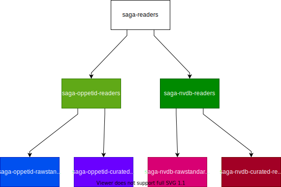

# Tilgang til data

Ulik data har behov for ulike nivåer av tilgjengelighet på grunn av innholdet i dataene. Derfor har vi tilgangskontroll, som styrer tilgang til data, ved hjelp av ulike tilgangsgrupper.

## Hvordan gir jeg tilgang til mine datasett?

Alle prosjekter har definert enkeltpersoner (én eller flere) som kan administrere tilgangsgruppene for sitt prosjekt. Hvis du lurer på hvem dette er for ditt prosjekt, ta kontakt på [#saga-support på Slack](https://vegvesen.slack.com/archives/C03LGD7TM5Z).

En tilgangsadministrator kan gi tilgang til andre via [Google Groups](https://groups.google.com). Du kan følge [Googles dokumentasjon](https://support.google.com/groups/answer/2465464?hl=en) for detaljerte steg.

## Type tilgang på dataplattformen

Vi bruker et gruppehierarki for å styre brukernes tilgang til ulike prosjekter og datasoner på dataplattformen. Dette gjør det enkelt å gi personer eller "service accounts" tilgang til en eller flere prosjekter eller datasoner.

I hovedsak trenger vi to typer grupper:

- reader
- observer

En _reader_-gruppe brukes for å få lesetilgang til en eller flere prosjekter eller datasoner. En _observer_-gruppe gir bare tilgang til å få vite hvilke datasett som eksisterer, og lese metadata om disse.

For å se hvilke GCP-roller en gruppe har, [se denne siden](01-detaljert.md).

### Observers

Alle brukere av plattformen blir p.t. lagt til i gruppen `saga-observers`, som gir rettigheter til å se metadata for alle datasett, men ikke innholdet.

### Readers

Den mest generelle tilgangsgruppen, som gir lesetilgang til alle prosjekter og datasoner, heter `saga-readers`. Yggdrasil styrer hvem som ligger i denne.

På neste nivå har man to dimensjoner:

- **Per datasone**: F.eks. `saga-curated-readers`, gir lesetilgang til datasett i datasonen "Curated", for alle prosjekter. Yggdrasil styrer hvem som ligger i denne.
- **Per prosjekt**: F.eks. `saga-oppetid-readers`, gir lesetilgang til datasett i prosjektet "Oppetid", uansett datasone. Prosjekt-team kan selv legge til medlemmer i denne.

Til slutt har man tilgangsgrupper som kombinerer prosjekt og datasone, f.eks. `saga-oppetid-curated-readers`, som gir lesetilgang til datasett som ligger i datasonen "Curated" i prosjektet "Oppetid". Det er på dette nivået selve tilgangsstyringen faktisk skjer, dvs. der [IAM bindings opprettes mot BQ datasets](https://cloud.google.com/bigquery/docs/access-control#dataset_level).

#### Gruppehierarki for prosjekter

Når en person er lagt til i en gruppe, har personen automatisk tilgang til alle undergrupper. Her vises et eksempelhierarki for prosjekt-nivå:

#### Gruppehierarki for datasoner

Denne figuren viser tilsvarende koblinger på datasone-nivå. Fargene brukes for å vise hvilke undergrupper som er de samme i de to ulike hierarkiene.

### Uegnede datalagere

Datalagere som mangler tilgangsstyring per datasett skal helst ikke brukes når du skal dele data på dataplattformen. For eksempel er det slik at dersom du gir noen lesetilgang til Cloud Datastore vil de få tilgang til alt som ligger der. Dette gjør at du for eksempel ikke kan skille mellom data som alle skal ha tilgang til, og data som færre skal ha tilgang til.

## Direkte tilgang til ressurser

Dersom det er behov for at brukere skal ha direkte tilgang til ressurser, og ikke datasoner, kan dette løses ved å opprette IAM-bindings direkte, eksempelvis i Terraform. Vi anser at dette sjelden vil være nødvendig.
