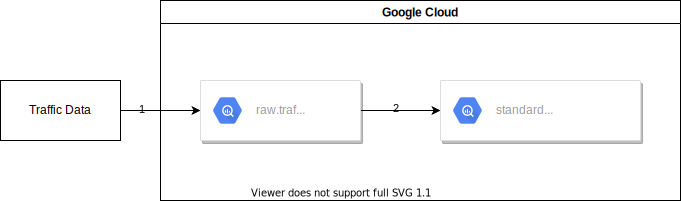

# Hvordan få data inn i Saga

Som domeneteam på Saga er man avhengig av data. Mange datasett er allerede tilgjengelige i [datakatalogen](https://saga-datacatalog-prod-lszg.ew.r.appspot.com/), men ofte vil man ha behov for å hente inn nye datakilder.

Når data skal deles i datakatalogen, eller benyttes som del av et foredlet dataprodukt, bør man lage en automatisk ingest-pipeline. For at denne skal kunne bygges og vedlikeholdes på en robust og effektiv måte, er det en del prinsipper som bør følges:

1. **Gjenproduserbar infrastruktur** - Alle ressurser som benyttes i GCP bør provisjoneres på en reproduserbar og versjonert metode, slik at man kan være sikker på at samme infrastruktur kjører i ulike miljøer, samt kunne sette opp infrastruktur på nytt dersom det skulle være nødvendig. I praksis betyr dette at ressurser defineres i Terraform, sjekkes inn i kode og deployes via CI/CD (f.eks. GitHub Actions).
1. **Keep it simple** - Lag den enkleste arkitekturen som oppfyller kravene til ingest. I mange tilfeller betyr dette en eller flere Cloud Functions, men kan også være enkle [scheduled queries](https://cloud.google.com/bigquery/docs/scheduling-queries), eller data-verktøy som [DBT](https://www.getdbt.com/). I mer avanserte scenarier kan orkestreringstjenester som [Dataflow](https://cloud.google.com/dataflow) være nødvendig, men bør ikke være førstevalg for enhver løsning, pga økt kompleksitet og kostnad.
1. **Idempotens og deduplisering** - I GCP kan det skje at functions feiler og blir retryet; det er derfor viktig at enhver pipeline er laget slik at gjentatte kjøringer ikke fører til inkonsistente data. For eksempel kan man ha ulike BigQuery-tabeller for "landing" og visning av data, der den førstnevnte kan inneholde duplikater, mens den endelige tabellen kun viser deduplisert data, f.eks. ved å definere et view, eller en merge query fra landings-tabellen.

## Pipeline-arkitekturer

Når man skal hente data fra et annet system, kan man gjøre dette enten ved å eksplisitt spørre systemet ("pull"), eller ved å åpne for at systemet kan sende inn data selv ("push").

### Pull-pipelines

Integrasjoner som henter data ved "pulling" kjennetegnes ved følgende:

- Kildesystemet må ha et endepunkt som er tilgjengelig fra internett
  - Det kan f.eks. være et REST API eller en database, og kan godt være passordbeskyttet eller sikret på annen måte
  - Unntaksmessig kan det settes opp VPN-kobling fra interne SVV-systemer til GCP
- Integrasjonen er ansvarlig for oppdateringsfrekvens og validering av data
- Kildesystemet trenger ikke kjenne til integrasjonen eller Saga
- Henting av data skjer periodisk, f.eks. via en Cloud Scheduler

#### Eksempel

Her er et eksempel på en "pull"-pipeline som bruker Cloud Functions, GCS og BigQuery, for et tenkt "Weather" API:

1. En Cloud Scheduler trigger hver time og kaller function'en `weather-poller` over HTTP
1. Polleren gjør et REST-kall mot API og henter værdata i JSON-format
1. Polleren lagrer JSON uendret i en GCS-bøtte `weather-ingest`
1. En Cloud Function `weather-standardizer` lytter på nye filer i `weather-ingest`-bøtta, leser disse og konverterer dem til et standardisert format
1. Standardizeren streamer data til en tabell `internal.weather`
1. Et view `standardized.weather` dedupliserer data fra `internal.weather` basert på et definert unikhetskriterie (f.eks. målestasjon og tidspunkt)

### Push-pipelines

Integrasjoner som henter data ved "pushing" kjennetegnes ved følgende:

- Integrasjonen må tilgjengeliggjøre et endepunkt som kildesystemet kan sende data til
  - Dette kan være f.eks. en Pub/Sub-topic, en GCS-bucket eller en BigQuery-tabell
- Kildesystemet styrer oppdateringsfrekvens; kan være periodisk, kontinuerlig eller sporadisk
- Kildesystemet må kjenne til Saga og autentisere seg mot GCP, typisk via en Service Account
- Kildesystemet trenger ikke være eksponert på internett, men må kunne gjøre kall mot GCP

#### Eksempel

Her er et eksempel på en veldig enkel "push"-pipeline der et kildesystem skriver direkte til BigQuery:

1. Kildesystemet skriver kontinuerlig data til BigQuery-tabellen `raw.trafficdata`
1. En [scheduled query](https://cloud.google.com/bigquery/docs/scheduling-queries) transformerer og merger data i standardisert form inn i tabellen `standardized.trafficdata`

Merk at selv om denne arkitekturen ved første øyekast ser mye enklere ut enn "pull"-pipelinen, så er mye av kompleksiteten og ansvaret flyttet til kildesystemet; det blir opp til dette å sørge for at data blir sendt på riktig tid og i riktig format.
