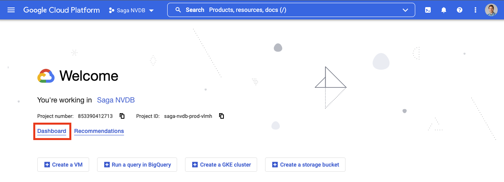

# Kostnader og budsjett

For mange av tjenestene på GCP betaler man for forbruk. Eksempler:

- Spørringer i BigQuery (EU-multiregion): $5 per TB prosessert, første TB per måned er gratis.
- Lagring i BigQuery: $2 per 100 GB lagret i "active storage", $1 per 100 GB i "long-term storage". Første 10 GB per måned er gratis.

Spesielt VMer kan fort bli kostbare:

- 1 stk VM av typen `e2-standard-4` i `europe-west3` har 4 CPU-kjerner og 16GB RAM, og koster $126 per måned.

[Se Googles dokumentasjon for mer info om priser.](https://cloud.google.com/pricing)

## Budsjett

For at man ikke skal gå på en smell - enten pga. ukritisk bruk av ressurser, eller dersom uvedkommende skulle få tak i en privatnøkkel og spunnet opp mange nye ressurser - er alle GCP-prosjekter på Saga tilknyttet et budsjett.

Budsjettet er som standard satt til **$1000 per prosjekt per måned**. Dersom budsjettet overskrides med 100%, det vil si at man har brukt over $2000, blir prosjektet automatisk deaktivert.

### Hvordan kan man se hvor mye penger man har brukt?

1. På velkomstsiden til prosjektet ditt kan du gå til "Dashboard":
   
1. På dashboardet skal du kunne se en widget med navn "Billing", som viser forbruk for inneværende måned:
   

Du kan også klikke deg inn på denne for å se detaljert kostnadsinformasjon.

#### Varslinger

Når man har nådd enkelte terskler for budsjettbruk (50%, 70% og 100%) vil man få beskjed om dette:

- Personlige prosjekter for utviklere og datavitere vil gi varsel til den enkeltes e-postadresse.
- Team-eide prosjekter vil få sendt en mail til deres `#[team]-alerts` Slack-kanal på Saga-slacken.

I tillegg kan man holde et øye med "Billing"-widgeten på dashboardet.

### Hva skjer når budsjettet er nådd?

Budsjetter i GCP har i utgangspunktet kun rapporteringsfunksjon; ingen funksjonalitet blir deaktivert direkte som følge av at et budsjett er nådd.

Vi har derfor bygd en "Billing Watchdog": En Cloud Function som får kontinuerlig oppdatert budsjettinformasjon for alle prosjekter, og når et prosjekt når 200% av sitt budsjett, stenges det ned, og frakobles billing-accounten.

### Hva betyr det at prosjektet blir deaktivert?

Når et prosjekt stenges ned vil det ikke lenger være mulig å benytte ressurser i det prosjektet, eller opprette nye ressurser. Prosjektet vil også stå som "slettet" i GCP.

Prosjektet vil være tilgjengelig for gjenoppretting i 30 dager, men merk at **noen ressurser, som Storage Buckets og Pub/Sub, vil kunne slettes mye tidligere**. [Les mer om stengte prosjekter hos GCP](https://cloud.google.com/resource-manager/docs/creating-managing-projects#shutting_down_projects).

For å få gjenopprettet stengte prosjekter, ta kontakt på [#saga-support på Slack](https://vegvesen.slack.com/archives/C03LGD7TM5Z).
