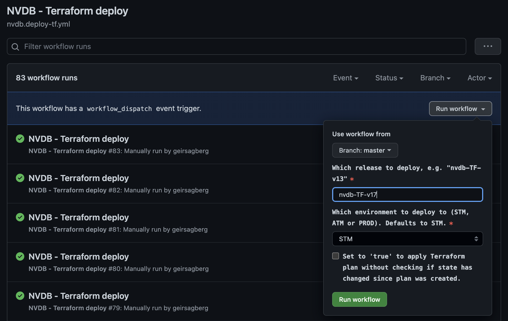
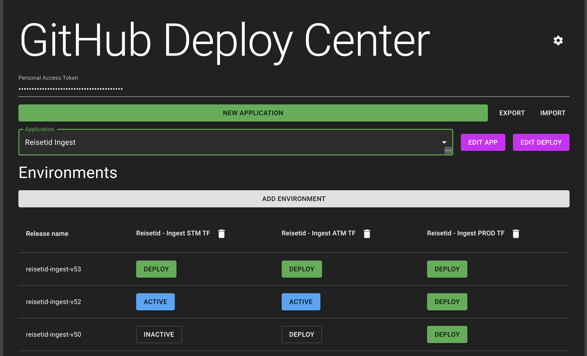

# GitHub Actions & Workflows

Dersom man benytter GitHub for kildekontroll kan man også bruke [GitHub Actions](https://docs.github.com/en/actions) for automatiserte oppgaver, som release og deploy, kjøring av tester og linting.

For å få en oversikt over konsepter som Workflows, Events, Jobs og Actions, [se dokumentasjonen til GitHub](https://docs.github.com/en/actions/learn-github-actions/understanding-github-actions).

Vi har laget et repo [github-actions-public](https://github.com/svvsaga/github-actions-public) med mange nyttige workflows og actions, f.eks.:

- Workflows:
  - [Publisere en Terraform-plan til alle 3 miljøer](https://github.com/svvsaga/github-actions-public/blob/main/.github/workflows/publish-terraform-plans.yml)
  - [Deploye en publisert Terraform-plan](https://github.com/svvsaga/github-actions-public/blob/main/.github/workflows/apply-terraform-plan.yml)
- Actions:
  - [Setup Google Cloud SDK med autentisering](https://github.com/svvsaga/github-actions-public/blob/main/setup-gcloud/action.yml)
  - [Vise endringer i Terraform ved Pull Request](https://github.com/svvsaga/github-actions-public/tree/main/show-terraform-plan-on-pr)

Det kommer stadig flere tilskudd, og hvis det er noe dere savner er det bare å ta kontakt på [#saga-support på Slack](https://vegvesen.slack.com/archives/C03LGD7TM5Z).

## `projects.config.json`

Mange av våre GitHub Actions og Workflows forutsetter at man har lagt inn en `projects.config.json`-fil for prosjektet man jobber i, samt én `projects.config.json`-fil i roten av repoet, som beskriver teamets felles-prosjekt. Disse filene vil se ut som noe slikt:

### `projects.config.json` i roten av repoet:

```json
{
  "projectNumbers": {
    "SHARED": 123456789
  },
  "SHARED": "saga-myteam-shared"
}
```

### `projects.config.json` inne i mappen til et prosjekt:

```json
{
  "projectNumbers": {
    "STM": 123456789,
    "ATM": 234567834,
    "PROD": 3456457645
  },
  "STM": "saga-my-project-stm",
  "ATM": "saga-my-project-atm",
  "PROD": "saga-my-project-prod"
}
```

Disse benyttes blant annet til å gjøre autentisering med GCP, via [Workload Identity Federation](https://cloud.google.com/iam/docs/workload-identity-federation), som er et sikrere alternativ til langtlevende Service Account Keys.

For å generere disse filene automatisk, sørg for at du er inlogget i `gcloud`, og deretter kjør:

```
npm install -D svvsaga/node-modules-public
npx generate-gcp-project-config-interactive
```

Du vil bli bedt om å velge ditt team, og ditt prosjekt. Prosjektet må matche en mappe som allerede finnes.

## Eksempel: Release og deploy av Terraform

Gitt at man ønsker å deploye en ny versjon av et system hver gang det gjøres en kodeendring, kan man sette opp en workflow som trigger på endringer i hoved-branchen:

```yaml
name: Publish my app on changes

on:
  # Gjør at workflow trigger på push til main hvis det er endringer i my-app/
  push:
    branches:
      - main
    paths:
      - my-app/**
  # Gjør det mulig å kalle workflow manuelt
  workflow_dispatch:

env:
  # Brukes av create-release for å kalle GitHub API
  GITHUB_TOKEN: ${{ secrets.GITHUB_TOKEN }}
  # Brukes for å gi navn til releasen
  APP_ID: my-app
  # Brukes for å sette nummer på releasen
  RELEASE_VERSION: ${{ github.run_number }}

jobs:
  # Først opprettes en release
  create_release:
    name: Terraform plan
    runs-on: ubuntu-latest
    # Denne jobben er definert som et sett av steg (i dette tilfellet bare ett steg)
    steps:
      - name: Create Release
        id: create_release
        uses: actions/create-release@v1
        with:
          tag_name: ${{ env.APP_ID }}-TF-v${{ env.RELEASE_VERSION }}
          release_name: ${{ env.APP_ID }}-TF-v${{ env.RELEASE_VERSION }}
    outputs:
      # Gjør det mulig å referere til den opprettede releasen i følgende jobb
      release_id: ${{ steps.create_release.outputs.id }}

  # Deretter kjører en ferdig workflow som publiserer 3 ulike Terraform-planer, en for hvert miljø (STM, ATM, PROD)
  publish_plans:
    name: Publish Terraform plans
    # Når 'needs' er satt, vil ikke denne jobben kjøre for forrige jobb er ferdig, slik at outputs er tilgjengelige
    needs: create_release
    # Denne jobben har ikke egne steg, men refererer til en spesifikk versjon av en ferdig workflow på github-actions-public repo
    uses: svvsaga/github-actions-public/.github/workflows/publish-terraform-plans.yml@v9.0.0
    with:
      app_root: my-app
      release_id: ${{ needs.create_release.outputs.release_id }}
    secrets:
      # En installert GitHub App brukes for å autentisere mot GitHub for operasjoner som går utover det den innebygde token får lov å gjøre
      github_app_private_key: ${{ secrets.ACTIONS_APP_PEM }}
      github_app_id: ${{ secrets.ACTIONS_APP_ID }}
      # Man kan sende med ekstra Terraform-variabler
      terraform_vars: |-
        slack_auth_token = "${{ secrets.SLACK_AUTH_TOKEN }}"
```

Med denne workflowen vil hver kodeendring føre til en ny release. Man kan også opprette nye releases manuelt ved å gå til Actions-fanen og kjøre workflowen manuelt:


I dette tilfellet er det også satt opp et eget input-felt for å overstyre hvilken commit eller branch man vil publisere, men det er ikke nødvendig.

### Deploy

Når workflowen for å lage release er grønn, kan man fortsette med selve deployen. En typisk deploy-workflow kan se slik ut:

```yaml
name: My app - Terraform deploy
on:
  workflow_dispatch:
    inputs:
      # Man må manuelt sjekke hvilken release man har publisert sist
      ref:
        description: Which release to deploy, e.g. "my-app-TF-v13"
        required: true
        default: my-app-TF-v
        type: string
      # Her benyttes en 'choice' type for å gi en dropdown i GUI
      environment:
        description: Which environment to deploy to (STM, ATM or PROD). Defaults to STM.
        required: true
        default: STM
        type: choice
        options:
          - STM
          - ATM
          - PROD
      # Workflowene vil vanligvis avbryte dersom det finnes forskjeller i state mellom når planen ble laget og når den skal deployes. Man kan overstyre dette ved å sette skip_diff=true, f.eks. hvis man må re-kjøre en deploy som kjørte halvveis vellykket
      skip_diff:
        required: false
        default: 'false'
        description: Set to 'true' to apply Terraform plan without checking if state has changed since plan was created.
        # Vil gi en checkbox i GUI
        type: boolean

jobs:
  deploy:
    uses: svvsaga/github-actions-public/.github/workflows/apply-terraform-plan.yml@v9.0.1
    with:
      ref: ${{ inputs.ref }}
      environment: ${{ inputs.environment }}
      skip_diff: ${{ inputs.skip_diff }}
      app_root: my-app
      application_name: My App
    secrets:
      github_app_private_key: ${{ secrets.ACTIONS_APP_PEM }}
      github_app_id: ${{ secrets.ACTIONS_APP_ID }}
```

Kjøringen av denne workflowen kan gjøres på samme Actions-fane i GitHub:



Det er også mulig å benytte verktøy som [GitHub Deploy Center](https://githubdeploy.z1.web.core.windows.net/) for å gjøre deployment enklere:



Her kan du sette opp deployment per miljø av flere ulike applikasjoner, samt se hvilke versjoner som er deployet i hvilke miljø. Les mer på https://github.com/geirsagberg/github-deploy-center, eller ta kontakt med [#saga-support på Slack](https://vegvesen.slack.com/archives/C03LGD7TM5Z) for mer informasjon.
