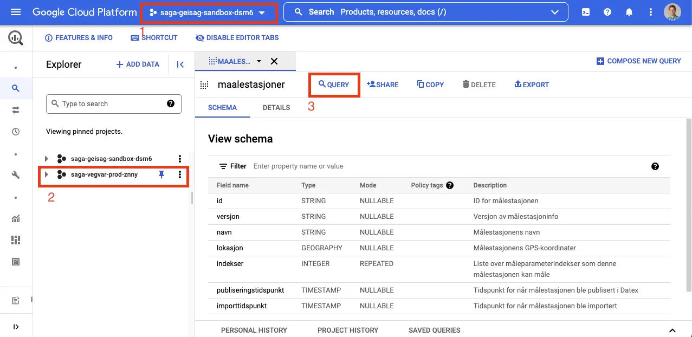
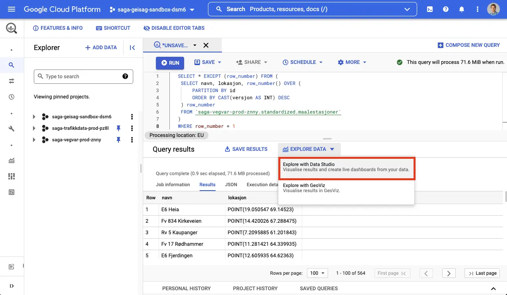
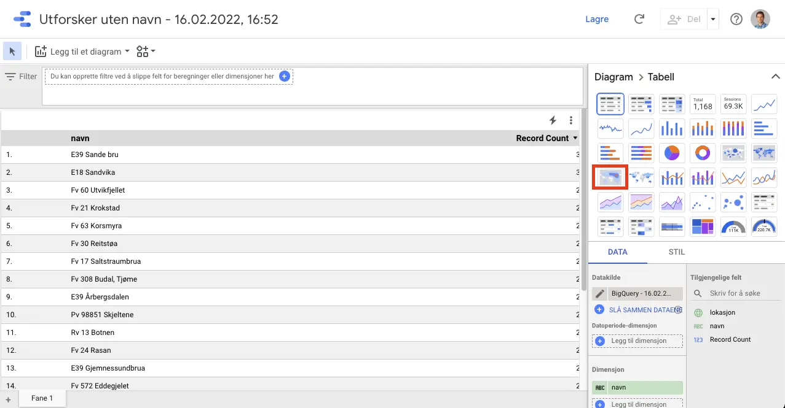
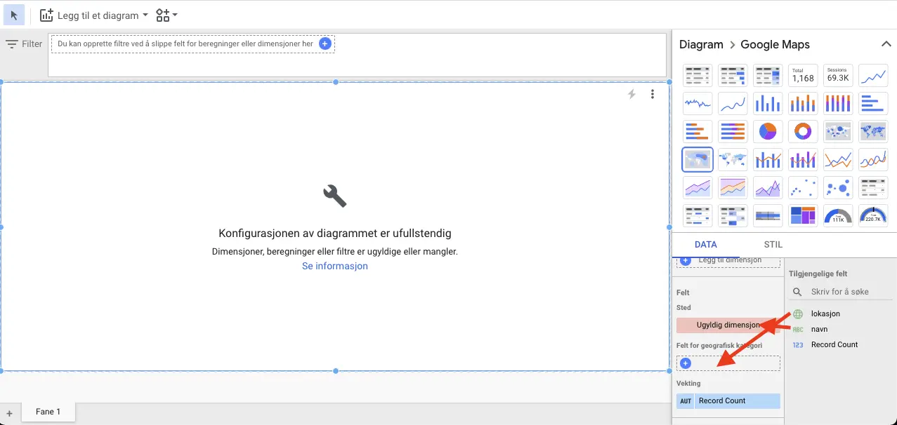
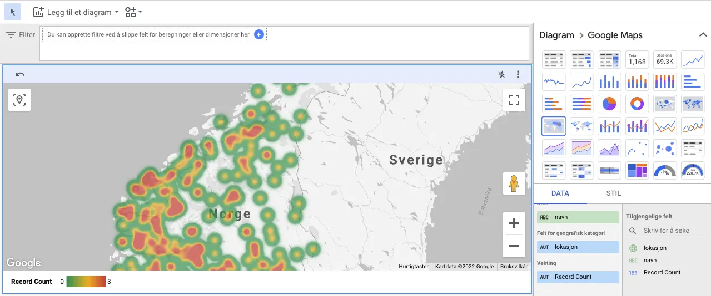

# Kartvisning av alle værstasjoner i Data Studio

Her viser vi et eksempel på hvordan man kan hente ut og visualisere værdata fra Vegvær, ved hjelp av BigQuery og Data Studio.

For å kunne følge guiden må du først ha fått opprettet en GCP-bruker og et prosjekt.

1. Gå til [Målestasjoner-datasettet i BigQuery](https://console.cloud.google.com/bigquery?p=saga-vegvar-prod-znny&d=standardized&t=maalestasjoner&page=table).

   

   Legg merke til følgende:

   1. Prosjektet i prosjektvelgeren skal være satt til ditt personlige prosjekt. Det gjør at du får lov å kjøre spørringer mot BigQuery.
   1. Prosjektet _saga-vegvar-prod-znny_ er der du finner Vegvær-datasettene.
   1. For å gjøre en spørring, velg **QUERY**.

1. Åpne en ny spørring, og legg inn følgende:

   ```sql
   SELECT * EXCEPT (row_number) FROM (
    SELECT navn, lokasjon, row_number() OVER (
        PARTITION BY id
        ORDER BY CAST(versjon AS INT) DESC
    ) row_number
    FROM `saga-vegvar-prod-znny.standardized.maalestasjoner`
   )
   WHERE row_number = 1
   ```

   Denne spørringen vil finne navn og lokasjon for siste versjon av alle målestasjoner. Den benytter [analytiske aggregat-funksjoner](https://cloud.google.com/bigquery/docs/reference/standard-sql/aggregate_analytic_functions) for å finne den siste versjonen.

1. Velg **EXPLORE DATA**, deretter "Explore with Data Studio".

   

1. Du vil bli bedt om å godkjenne bruk av Data Studio mot Google Cloud, godta dette. Deretter vil Data Studio åpnes med data fra spørringen du kjørte.

   Herfra kan du velge en kartvisning, f.eks. "Varmekart":

   

1. Kartvisningen mangler dimensjoner. Dra "lokasjon" inn i "Felt for geografisk kategori", og "navn" inn i "Sted":

   

1. Da skal du se en kartvisning over de ulike stasjonene:

   

   Herfra kan du klikke fritt rundt, eller gå tilbake og utvide spørringen med mer data. For å lese mer om Data Studio, se [Data Studio-dokumentasjonen](https://developers.google.com/datastudio/).
